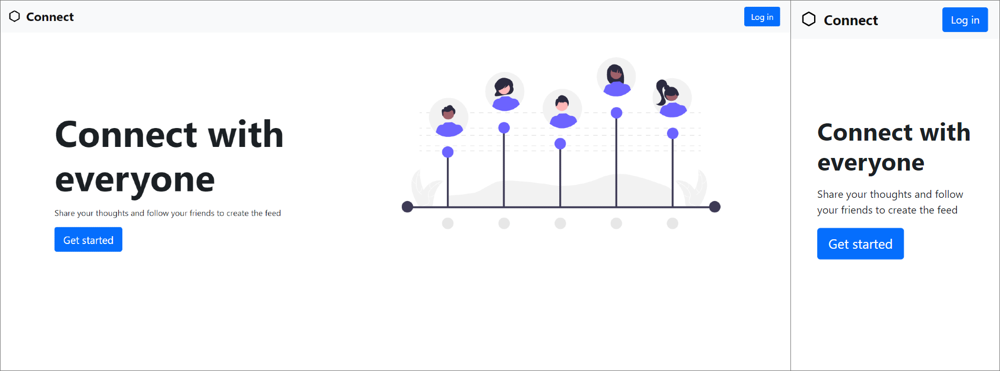
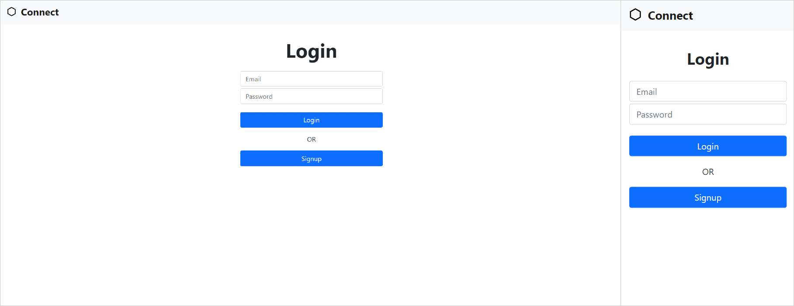
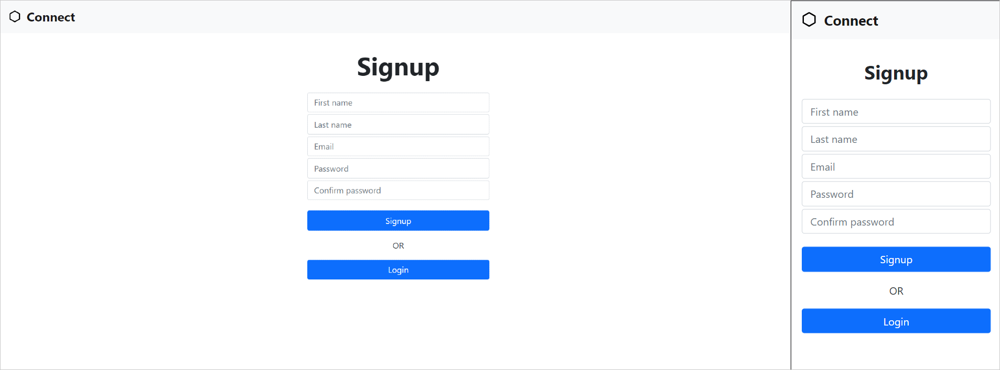
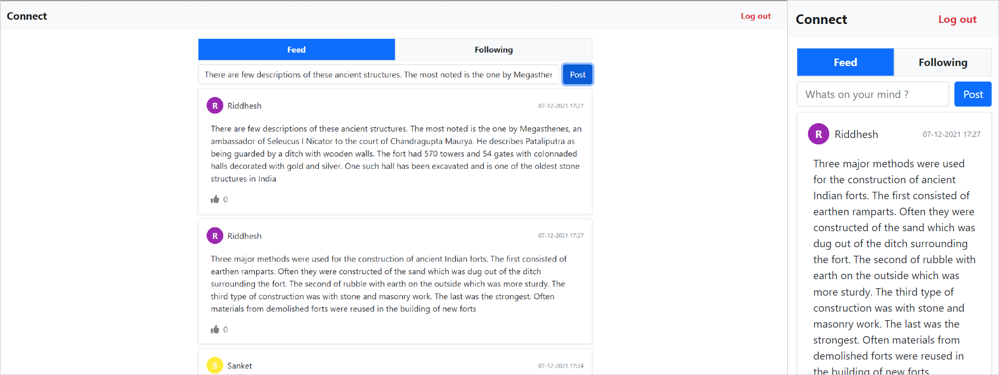

# Connect

Social network built using Ruby on Rails, React and Bootstrap.

&emsp;
# Prerequisites

The setups steps expect following tools installed on the system.

- Github
- Ruby [6.1.4.1](https://www.ruby-lang.org/en/downloads/)
- Rails [3.0.2p107](https://rubyonrails.org/)
  

&emsp;
# Setup

##### 1. Check out the repository

```bash
git clone git@github.com:organization/project-name.git
```

##### 2. Install required gems

```bash
bundle install
```

##### 3. Create and setup the database

Run the following commands to install react for rails.

```bash
bundle exec rails webpacker:install:react
```

##### 4. Create and setup the database

Run the following commands to create and setup the database.

```bash
rails db:create
rails db:setup
```

##### 5. Setup credentails
##### Delete folder **config\credentials**

##### Set editor to open credentials file
```bash
$env:EDITOR="code --wait"
```


##### Create and edit new credentials file

```bash
rails credentials:edit --environment development
```

##### Paste your jwt secret 
```bash
jwt:
  secret: dfrgs463hf77dyhe52
```

##### 6. Start the Rails server

You can start the rails server using the command given below.

```bash
rails s
```

##### 7. Open URL in web browser

[http://127.0.0.1:3000/#](http://127.0.0.1:3000/#)


&emsp;
# Technologies Used

| Name        | Description |
| ----------- | ---------------- |
| Ruby on Rails     | Ruby on Rails is a model–view–controller framework, providing default structures for a database, a web service, and web pages. |
| React | React is a free and open-source front-end JavaScript library for building user interfaces based on UI components. |
| Bootstrap  | Bootstrap is a free and open-source CSS framework directed at responsive, mobile-first front-end web development.  |


&emsp;
# Home Page


Home page is a landing page for users. It shows different features of the product. User can navigate to Login and Signup page through home page.

&emsp;
# Login


User can login using email and password. JSON Web Token (JWT) is used for login logic.

&emsp;
# Signup


User can create new account here. After successful signup, user will be redirected to login page.


&emsp;
# Dashboard


Dashboard has 2 parts
### **Feed**
Feed shows latests posts.

### **Following**
User can search other users using their full name and can follow them to receive latest posts in the feed.
